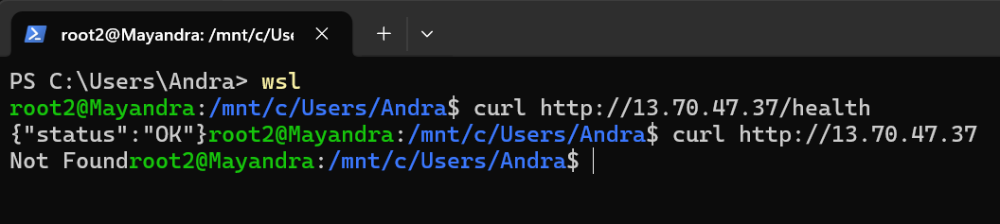

# Penugasan 1

Nama: Mayandra Suhaira Frisiandi  
NRP: 5025241240

## Deskripsi Singkat

Service sederhana menggunakan Node.js yang menyediakan endpoint `/health`. Service ini dijalankan menggunakan Docker dan dapat diakses melalui VPS.

## Endpoint

Jika request berhasil, response akan mengembalikan HTTP 200 OK dan response JSON.
```
if (req.url === '/health'){
	res.writeHead(200, { 'Content-Type': 'application/json' });
	res.end(JSON.stringify({status: 'OK'}));
}
```
Selain `/health`, semua endpoint akan mengembalikan 404 Not Found.

```
else {
	res.writeHead(404);
	res.end('Not Found')
}
```

## Build & Run Docker

Untuk membuat image, dijalankan:
```
docker build -t health .
```

Kemudian untuk menjalankan image tersebut menggunakan:
```
docker compose up -d
```

## Deployment ke VPS

Setelah mendapatkan VPS. Login menggunakan ssh dan buat folder untuk menaruh project.
```
mkdir projects
cd projects
```
Pada project lakukan clone repository dan masuk pada folder.
```
git clone https://github.com/Andra246/oprec_ncc
cd oprec_ncc
```

Dalam folder `oprec_ncc`, build dan run aplikasi seperti sebelumnya
```
docker build -t health .
docker compose up -d
```

Service dapat diakses melalui internet dengan IP VPS.


